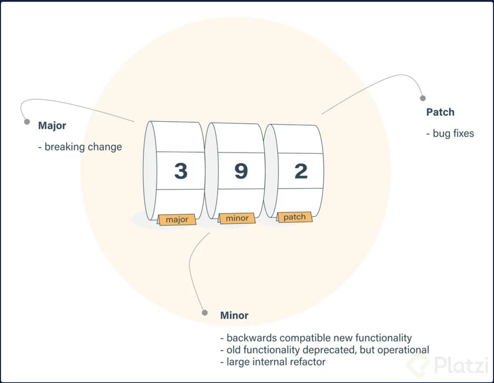

# [*Curso de NPM: Gestión de Paquetes y Dependencias en JavaScript(**Platzi**)*](https://platzi.com/cursos/npm/)

NPM es el gestor de paquetes y dependencias más usado para desarrollar con JavaScript. Con NPM podrás administrar módulos, distribuir paquetes y agregar dependencias a tus proyectos. Crea tus propias librerías y domina una de las herramientas más importantes en el desarrollo con JavaScript. Tu profesor, Oscar Barajas te enseña a:

* Versionar paquetes en NPM.
* Publicar paquetes en NPM.
* Crear paquetes para NPM.
* Actualizar y eliminar dependencias.

> Instructor: **Oscar Barajas Tavares**

## Temario

1.- Bienvenido(a) a NPM

Te damos la bienvenida al Curso de NPM: Gestión de Paquetes y Dependencias en JavaScript.

En este curso aprenderás a:

* Qué es NPM, dependencias y paquetes
* Cómo instalar dependencias a un proyecto
* Cómo compartir y crear paquetes para la comunidad
* Cómo funcionan los paquetes públicos y privados en NPM

Herramientas que emplearás

* Visual Studio Code: es el editor de código que se recomienda utilizar para tus proyectos y ofrece varias características para mejorar tu experiencia en el desarrollo.
* Una terminal, ya sea en MacOS, Linux, o Windows Subsystem for Linux. Si no sabes qué es la terminal, toma el curso de: [Introducción a la Terminal y Línea de Comandos](https://platzi.com/cursos/terminal/).

Contribuciones del curso creadas por Andrés Guano (Platzi Contributor).

2.- Gestión de dependencias

Un módulo es un archivo (de JavaScript) que contiene una parte de la solución de un problema.

Un paquete o librería es el conjunto de módulos para resolver un problema.

Una dependencia, como su nombre lo indica, es un paquete que tu proyecto necesita para funcionar.

La gestión de dependencias es la forma de compartir recursos creados y validados por terceros entre la comunidad. Los gestores de dependencias permiten organizar, administrar y brindar herramientas para el manejo de paquetes. Esta es la importancia de NPM (Node Package Manager), el gestor de dependencias más popular en js.

Breve reseña histórica:

* En 1995, se crea JavaScript, uno de los lenguajes más populares y el único para la interactividad en páginas web.
* En 2009, se crea Nodejs, un entorno de ejecución de JavaScript en el lado del servidor. En este año también se crea NPM, el gestor de dependencias que nace junto a Nodejs.

Importancia de los gestores de dependencias:

Los gestores de dependencias, por ejemplo NPM, permiten organizar, administrar y brindar herramientas para el manejo de paquetes. Esto permite a los desarrolladores trabajar sobre sus propios problemas, sin preocuparse de solucionar otros problemas ya resueltos.

Según sea el caso, puedes utilizar paquetes y módulos en tu proyecto. Sin embargo, el abuso de estos puede generar problemas en tu proyecto, desde la inclusión de bugs, problemas de seguridad, o que el paquete deje de ser mantenido y validado.

La página oficial de NPM permite conocer toda la información de un paquete. Por ejemplo, React es un paquete para construir interfaces gráficas, en la página del paquete de React tendrás información de instalación, participantes, versiones, documentación y posibles soluciones de errores.

Existen otros gestores de dependencias, como Yarn o PNPM. No obstante, en este curso se tratará sobre NPM, ya que es el más popular. Aunque estos gestores comparten funcionalidades en común.

Contribución creada por Andrés Guano (Platzi Contributor).

3.- Instalación de NPM en MacOS

4.- Instalación de NPM en Windows

5.- Primeros pasos en NPM

Desde una terminal o línea de comandos, crea un directorio con el nombre de tu proyecto. Después, como buena práctica, inicia un repositorio local de Git dentro de la carpeta creada.

El símbolo $ representa la línea de entrada para los comandos en la terminal.

```bash
Terminal

$ mkdir npm
$ cd npm
$ git init //Initialized empty Git repository in /pruebas/.git/
```

Una vez creado el espacio correspondiente al proyecto de JavaScript. Deberás tener un archivo de configuración llamado `package.json.`

### Cómo estructurar un archivo de configuración package.json

El archivo `package.json` es un archivo de configuración que contiene la información más importante de tu proyecto como: datos específicos, dependencias, dependencias de desarrollo y archivos de ejecución.

Este archivo, como su extensión lo indica, está estructurado en formato JSON (JavaScript Object Notation) que sirve para una mejor lectura e interpretación para los usuarios y las máquinas.

### Datos específicos del archivo package.json

Los datos específicos ayudan a identificar el proyecto y actúan como una base para que los usuarios y los contribuidores obtengan información sobre el proyecto.

El archivo `package.json` estaría estructurado inicialmente por las siguientes propiedades:

```bash
"name": Indica el nombre del proyecto.
"version": Indica la versión del proyecto.
"description": Indica una breve descripción del proyecto.
"main": Indica el archivo principal del proyecto.
"scripts": Indica los comandos a ejecutar del proyecto (no te preocupes por el comando test por ahora).
"keywords": Indica las palabras clave del proyecto.
"author": Indica el nombre y dirección de correo electrónico del propietario del proyecto.
"license": Indica la licencia del proyecto.
```

El archivo package.json estaría estructurado de la siguiente manera:

``` bash
{
    "name": "npm",
    "version": "1.0.0",
    "description": "Constuir un paquete para node",
    "main": "src/index.js",
    "scripts": {
        "test": "echo \"Error no test specified\" && exit 1"
    },
    "keywords": [ "javascript", "node", "package" ],
    "author": "TuNombre tucorreo@gmail.com",
    "license": "MIT"
}
```

### Cómo utilizar el comando npm init

Aunque puedes crear el archivo de configuración manualmente, NPM te ayuda a crearlo rápidamente mediante el comando npm init. Este comando te permite ingresar los datos específicos del proyecto y genera el archivo package.json en tu directorio.

```bash
# This utility will walk you through creating a package.json file. It only covers the most common items, and tries to guess sensible defaults.
$ npm init

# See npm help init for definitive documentation on these fields and exactly what they do.

# Use npm install <pkg> afterwards to install a package and save it as a dependency in the package.json file.

Press ^C at any time to quit. package name: (npm)
```

Puedes ingresar tus propios datos, o utilizar la recomendación de NPM (lo que está entre paréntesis) y solamente dar enter. Al final, te preguntará si la configuración del package.json es correcta para generar el archivo.

```bash
version: (1.0.0)
description: Constuir un paquete para node
entry point: (index.js) src/index.js
test command: npm test git
repository:
keywords: javascript, node, package author: TuNombre tucorreo@gmail.com license: (MIT) About to write to /npm/package.json:

{
    "name": "npm",
    "version": "1.0.0",
    "description": "Constuir un paquete para node",
    "main": "src/index.js",
    "scripts": {
        "test": "echo \"Error no test specified\" && exit 1"
    },
    "keywords": [ "javascript", "node", "package" ],
    "author": "TuNombre tucorreo@gmail.com", "license": "MIT"
}

Is this OK? (yes)
```

### Cómo utilizar el comando npm init --yes

El comando npm init --yes o npm init -y te ayudará a crear un archivo package.json de manera rápida con una configuración por defecto, sin la necesidad de ingresar los datos.

Para establecer esta configuración por defecto, necesitarás utilizar el comando npm config set init-`atributo`. Te comparto algunas de las configuraciones por defecto más comunes:

```bash
Terminal
$ npm config set init-author-name "Tu Nombre"
$ npm config set init-author-email "<TuEmail@email.com>"
$ npm config set init-author-url "<https://tuWeb.com>"
$ npm config set init-license "MIT"
$ npm config set init-version "0.0.1"
```

De esta manera ya estás listo para gestionar dependencias de tu proyecto con NPM.

Contribución creada por Andrés Guano (Platzi Contributor).

### Documentación asociada

[Comandos npm](https://docs.npmjs.com/cli/v9/commands)

[Comando npm init](<https://docs.npmjs.com/cli/v9/commands/npm-init>)

6.- Instalación de dependencias

Las dependencias son paquetes que vamos a utilizar en nuestro proyecto. Un paquete es el conjunto de módulos para resolver un problema. Saber manejar las dependencias en un proyecto permite desarrollar la aplicación más rápido sin partir desde cero.

Existen tres tipos de dependencias: locales, desarrollo y globales.

### Qué son las dependencias locales

Las dependencias locales son aquellas que son obligatorias para el proyecto, es decir, son las necesarias para que la aplicación funcione en producción. Producción significa que tu aplicación está disponible para usarse.

### Cómo instalar dependencias locales

Para instalar una dependencia local, utiliza uno de los siguientes comandos, donde es el nombre del paquete.

```bash
Cónsola:

$ npm install <paquete> 
$ npm install --save <paquete>
$ npm install -S <paquete>
```

Las dependencias locales se encuentran en el package.json en la propiedad "dependencies", seguido de la versión que fue instalada.

``` shell
{
    ... "dependencies":{
            "paquete": "1.0.0"
        }
}
```

### Qué son las dependencias de desarrollo

Las dependencias de desarrollo son aquellas que no son obligatorias para el proyecto, es decir, sin estas la aplicación servirá. Estas dependencias ofrecen una ayuda para construir código de forma óptima, por ejemplo, formatear el código, agregar estilos, levantar un servidor para observar los cambios.

#### Cómo instalar dependencias de desarrollo

Para instalar una dependencia de desarrollo, utiliza el siguiente comando, donde es el nombre del paquete.

```bash
Cónsola:

$ npm install --save-dev <paquete>
$ npm install -D <paquete>
```

Las dependencias de desarrollo se encuentran en el package.json en la propiedad "dev-dependencies", seguido de la versión que fue instalada.

```shell
{
    ... "dev-dependencies":{
            "paquete": "1.0.0"
        }
}
```

### Qué son las dependencias globales

Las dependencias globales son aquellas que están disponibles para todos los proyectos en tu computador, pero no aparecen el archivo de configuración package.json.

#### Cómo instalar dependencias globales

Para instalar una dependencia global, utiliza el siguiente comando, donde es el nombre del paquete.

```bash
Cónsola:

$ npm install --global <paquete>
$ npm install -g <paquete>
```

`Ten en cuenta que para instalar dependencias globales requiera permisos elevados`, esto se soluciona con la palabra reservada sudo en terminales basadas en Unix, o en Windows ejecutando la terminal como administrador. Puedes revisar este artículo: `Resolving EACCES permissions errors when installing packages globally` para evitar dar permisos cada vez que instalas una dependencia global.

`Las dependencias globales no se encuentran en el package.json`, por esta razón recomiendo no abusar de esta herramienta, ya que el archivo de configuración es muy importante para que otros desarrolladores tengan toda la información pertinente al proyecto, incluyendo las dependencias a utilizar.

### Cómo visualizar los paquetes instalados

Para ver qué dependencias locales están instaladas, ejecuta el siguiente comando:

```bash
Cónsola:

$ npm list
```

Para ver qué dependencias globales están instaladas, ejecuta uno de los siguientes comandos:

```bash
Cónsola:

$ npm list -g
$ npm list -g --depth 0
```

Puedes utilizar el flag --depth para indicar la profundidad de dependencias, esto mostrará los paquetes que contiene cada paquete.

```bash
Cónsola:

$ npm list --depth 2
```

7.- Instalación de dependencias de versiones específicas

En ciertas situaciones es necesario instalar una versión específica de un paquete, ya sea porque el proyecto no puede actualizarse a versiones recientes, o porque el equipo necesita trabajar sobre una misma versión. Saber instalar cualquier versión de un paquete es fundamental para la gestión de dependencias de tu proyecto.

### Cómo instalar una versión específica de un paquete

Para instalar una versión exacta de una dependencia, utiliza el siguiente comando, donde es el nombre del paquete y es la versión exacta.

```bash
Cónsola:

$ npm install <paquete>@<versión>
```

También puedes usar la versión latest para asegurarte que está instalando la última versión disponible del paquete.

```bash
Cónsola:

$ npm install <paquete>@latest
```

Este comando instalará la versión exacta del paquete desde el repositorio de NPM. Esto sirve para manejar diferentes versiones del paquete instalado donde sea compatible con el proyecto actual y no provoque errores.

Por ejemplo:

```bash
Cónsola:

$ npm install json-server@0.15.0
```

### Cómo instalar dependencias opcionales

Para instalar una dependencia opcional, utiliza el siguiente comando, donde es el nombre del paquete.

```bash
Cónsola:

$ npm install --save-optional <paquete>
$ npm install -O <paquete>
```

Ten en cuenta la O mayúscula, si utilizas la o minúscula, el paquete se instalará como dependencia local.

Las dependencias de desarrollo se encuentran en el package.json en la propiedad "optionalDependencies", seguido de la versión que fue instalada.

``` bash
{
    ... "optionalDependencies": {
        "paquete": "1.0.0"
    }

}
```

### Simular la instalación de una dependencia

Para simular la instalación de una dependencia, utiliza el siguiente comando, donde es el nombre del paquete.

```bash
Cónsola:

$ npm install --dry-run <paquete>
```

Este comando mostrará el resultado de instalación sin instalarlo en el proyecto.

Por ejemplo:

```bash
Cónsola:

$ npm i react --dry-run

added 4 packages in 2s

23 packages are looking for funding run npm fund for details
```

### Cómo funciona el comando npm install

El archivo `package.json` contiene la información de las dependencias del proyecto, pero si no tienes instaladas esas dependencias, la manera para instalarlas todas en un solo comando es `npm install` o la forma corta `npm i`. De este modo, instalarás cada paquete con su respectiva versión indicada en el `package.json`.

Si únicamente tenías el archivo `package.json` después de ejecutar el comando, aparte de instalar todas las dependencias, se generará un archivo package-lock.json y un directorio llamado `node_modules`.

El archivo `package-lock.json` muestra todo el árbol de dependencias de tu proyecto. ¿Qué significa esto? Cada dependencia instalada también tiene sus respectivas dependencias, a estas se las denomina sub-dependencias. El árbol de dependencias muestra todas las sub-dependencias como si de ramas se tratasen.

El directorio `node_modules` contiene todos los archivos ejecutables de Nodejs y los módulos que contiene cada dependencia. Este directorio es ignorado por los repositorios de Git, por eso es importante el archivo `package.json`, ya que te permitirá instalar las dependencias con npm install cuando realices un fork de cualquier repositorio.

8.- Comandos en NPM (Scripts)

El apartado de `"scripts"` en el `package.json` es el que indica los comandos a ejecutar del proyecto. Esta sección es la que utilizarás para crear comandos que optimicen el desarrollo de tu aplicación.

### Cómo crear un comando en tu proyecto

Para crear un comando en tu proyecto, utiliza la siguiente estructura, donde es el nombre del comando que debería ser muy descriptivo y es el comando que utilizarías en la terminal.

```bash
{
    "scripts": {
        "<nombre>": "<comando>"
    }
}
```

Una vez hayas escrito el comando en el archivo `package.json`, la manera de ejecutarlo en la terminal será con el comando `npm run <nombre>`.

### Creemos algunos comandos comunes

Creemos tres comandos comunes: para iniciar el proyecto (start), crear un archivo para producción (build) y combinarlos (deploy). Que no te preocupe si no entiendes cada comando, solo entiende cómo ejecuta `NPM el script`.

```bash
{
    "scripts": {
        "start": "webpack-dev-server --open --mode development",
        "build": "webpack --mode production",
        "deploy": "npm run format && npm run build"
    }
}
```

Y para ejecutarlos, es necesario utilizar el comando respectivo en la terminal:

```bash
Cónsola:

$ npm run start || npm start
$ npm run build || npm build
$ npm run deploy || npm deploy
```

`NPM` provee algunos alias, como `npm start` que ejecuta lo mismo que `npm run start`.

### Cómo ejecutar un paquete de manera directa

`NPM` te permite instalar paquetes en tu proyecto, sin embargo, NPX (Node Package Execute) permite ejecutar un comando de NPM remotamente.

Ejemplos de este comportamiento son los paquetes React y Nextjs, para iniciar un proyecto en estos se puede ejecutar los siguientes comandos, donde es el nombre del proyecto:

```bash
Cónsola:

$ npx create-react-app <nombre>
$ npx create-next-app <nombre>
```

9.- Actualización de dependencias

Conocer cómo actualizar dependencias es muy importante para mantener tus proyectos actualizados y libres de vulnerabilidades de seguridad.

El comando ``npm outdate`` mostrará los paquetes que están desactualizados. Con el comando ``npm outdate --dd`` verás de manera más detallada esta información.

### Cómo actualizar dependencias

Para actualizar todas las dependencias utiliza el siguiente comando:

```bash
Cónsola:

$ npm update
```

Ten en cuenta que actualizar varios paquetes no es recomendable, solamente deberías actualizar un paquete si estás muy seguro de que no afectará al proyecto y que realizaste los cambios pertinentes.

```bash
Cónsola:

$ npm update <paquete>
```

Utiliza el siguiente comando para actualizar a la última versión (latest) de la dependencia, donde es el nombre del paquete.

```bash
Cónsola:

$ npm install <paquete>@latest
```

10.- Seguridad y solución de problemas

La seguridad de tu proyecto puede ser vulnerada por paquetes desactualizados. Al momento de instalar tus paquetes con el comando npm install muestra una serie de advertencias (NPM WARN) de las dependencias desactualizadas.

### Auditar tus dependencias

El comando `npm audit` muestra una descripción de las dependencias instaladas. Si se encuentran vulnerabilidades, se calculará el impacto al proyecto.

Si se requiere un informe más detallado en formato JSON (JavaScript Object Notation), utiliza el comando `npm audit --json`.

El comando `npm audit fix` proporciona una actualización de los paquetes, similar al comando `npm update <paquete>`. El comando `npm audit fix --force` proporciona una actualización de los subpaquetes de cada paquete, en todos sus niveles de profundidad.

Si el problema `persiste`, es necesario actualizar el paquete a su última versión.

```bash
Cónsola:

$ npm install <paquete>@latest
```

### Solución de problemas

Cuando estés desarrollando un proyecto con NPM, puede que generes errores que no permitan seguir con tu trabajo. Saber manejar los errores es fundamental para solucionarlos y seguir con tus tareas (y no entrar en pánico). Alguno de estos errores pueden ser:

* Errores en la configuración del archivo package.json
* Errores de dependencias en node_modules
* Errores del sistema operativo
* Configuración errónea de Git o GitHub
* Errores de escritura (typos)
* Errores que no estén ligados directamente a NPM

### Error de dependencias en node_modules

Existen situaciones en las que instalas una dependencia con una versión que no corresponde a la deseada. Esto ocurre porque NPM guarda en el caché una versión previamente instalada de un paquete, esto para mejorar los tiempos de instalación.

En esta situación, puedes utilizar los siguientes comandos, el primero para borrar el caché de NPM y el segundo para verificar si están eliminados correctamente.

```bash
Cónsola:

$ npm cache clean --force
$ npm cache verify
```

11.- Eliminación de dependencias y `package.lock`

Conocer cómo eliminar dependencias, `también es importante para mantener tus proyectos sin paquetes que no aporten la solución a tu problema, que ya no sean actualizados, o que exista una mejor implementación`.

### Cómo eliminar paquetes

Existen dos formas de eliminar paquetes:

* Eliminando el paquete con el siguiente comando:

    ```bash
    Cónsola:

    $ npm uninstall <paquete>
    ```

* Eliminarlo manualmente del archivo `package.json`. Al eliminar un paquete de manera manual, es necesario actualizar el directorio de `node_modules`.

### Cómo actualizar `node_modules`

Actualizar el directorio `node_modules` sirve para limpiar las dependencias que previamente estaban en el proyecto. También cuando existe algún archivo corrupto o una mala instalación.

Por lo tanto, deberás eliminar el directorio de `node_modules` y después ejecutar el comando npm install para instalar correctamente los paquetes. En ciertas situaciones, también es necesario eliminar el archivo package-lock.json.

Puedes utilizar el siguiente comando de `NPM` para evitar escribir demasiado cada vez que lo necesites.

```json
`package.json`
{
    "scripts": {
        "phoenix": "rm -f package-lock.json && rm -rf ./node_modules && npm i --no-fund --no-audit"
    }
}
```

### Mostrar los pasos ejecutados por un comando de `NPM`

Para identificar el error que puede existir en tu proyecto, es necesario analizar cada paso que ejecuta un comando, para saber en qué punto específico ocurre el problema.

El flag --dd en un comando de NPM, te mostrará de manera detallada cada paso ejecutado. De esta manera podrás observar si existe un error para solucionarlo.

```bash
Cónsola:

$ npm [comando] --dd
```

Otra forma, es ejecutar el comando de `NPM`. Si existe un error, la terminal te mostrará los diferentes errores que encontró. `Al final de este resumen, existirá una ruta con los detalles del error, puedes abrir tal archivo para observar los pasos que ejecutó`.


### Qué es el archivo `package-lock.json`

`El archivo package-lock.json describe todo el árbol de dependencias de cada paquete instalado`.

Cuando alguien hace fork de un repositorio no tiene el directorio `node_modules` por el archivo `.gitignore`. Mediante el comando `npm install`, instalarán las dependencias indicadas en el `package.json` con la versión indicada. También, se instalarán las sub-dependencias indicadas en `package-lock.json` con la versión indicada.

Esto es importante para tener instaladas siempre la versión adecuada del paquete a utilizar en el proyecto.

12.- Crear un paquete

Al crear un paquete para NPM, podrás compartir tu trabajo a varios desarrolladores e `instalar tu paquete` mediante `npm install <tuPaquete>`. Te mostraré un ejemplo, un proyecto de mensajes aleatorios que estará instalado globalmente y se ejecutará mediante la terminal.

### Cómo colocar un nombre a tu paquete

Al publicar un paquete, es necesario que el nombre sea único, es decir, no debe existir ningún otro paquete publicado con el mismo nombre en `NPM`.

Sin embargo, no agregues números, ya que `NPM` lo detecta como spam. Es válido agregar tu nombre de usuario para diferenciarlo,

Asegúrate de eso buscando en la página oficial de `NPM` el nombre del paquete, si no hay coincidencias lo puedes publicar.

### Proyecto de mensajes aleatorios

Como buena práctica, crea un repositorio remoto en GitHub(con el mismo nombre del paquete que quieres publicar) y clónalo en tu computador. Después, inicia un proyecto con `NPM` con el comando `npm init -y`. Con esto ya tienes todo listo para empezar el proyecto.

Dentro del proyecto crea la siguiente estructura de archivos:

* Un directorio llamado src que contenga el archivo principal del proyecto `index.js`
* Un directorio llamado bin que contenga un archivo ejecutable `global.js`


### Creando el archivo index.js

En el archivo `index.js` agrega el siguiente código:

* Un array llamado messages que contiene los mensajes
* Una función funnyCommit que mostrará de manera aleatoria los elementos del array, es decir, los mensajes aleatorios.
* Al final, exporta la función mediante `module.exports`.

```shell
const messages = [
  "This is where it all begins...",
  "Commit committed",
  "Version control is awful",
  "COMMIT ALL THE FILES!",
  "The same thing we do every night, Pinky - try to take over the world!",
  "Lock S-foils in attack position",
  "This commit is a lie",
  "I'll explain when you're older!",
  "Here be Dragons",
  "Reinventing the wheel. Again.",
  "This is not the commit message you are looking for",
  "Batman! (this commit has no parents)",
];

const funnyCommit = () => {
  const message = messages[Math.floor(Math.random() * messages.length)];
  console.log(`\x1b[34m${message}\x1b[89m`);
}

module.exports = {
  funnyCommit
};
```

### Creando el archivo `global.js`

En el archivo `global.js` agrega el siguiente código, en el que importamos la función del archivo `index.js` y la ejecutamos.

```shell
!/usr/bin/env node
let random = require('../src/index.js');

random.funnyCommit();
```

!/`usr/bin/env node` es una instrucción que sirve para indicar que este archivo se ejecutará con Nodejs. Después realizamos la importación de nuestro archivo index.js. Finalmente, ejecutamos la función de mensajes aleatorios funnyCommit.

### Modificar el archivo `package.json` para el proyecto

En el archivo `package.json`, agrega `"bin"` haciendo referencia a nuestro archivo `global.js` y `"preferGlobal"` en true.

``` bash
{
    ...
    "bin": {
        "random-str-msg": "./bin/global.js"
    },
    "preferGlobal": true
}
```

El nombre que especifiquemos dentro de `"bin"` será el que utilicemos en la terminal cuando el paquete esté instalado.

¡Listo! Ya tienes un paquete para publicarlo en `NPM`.

13.- Publicar un paquete

Antes de publicar el `proyecto de mensajes aleatorios`, debes asegurarte de que el paquete funcione correctamente.

### Cómo utilizar el comando npm link

El comando `sudo npm link` crea un enlace simbólico para reconocer este paquete dentro del listado de `NPM`, `sin publicarlo todavía`.

Si no presenta errores, está listo para ser publicado.

### Cómo simular la instalación de tu paquete

Para simular la instalación de tu paquete de manera local, identifica el directorio en el que te encuentras con el comando `pwd`, `debe ser el mismo del proyecto`.

Después, ejecuta `npm install -g <ruta>`, donde es la ruta del directorio de tu proyecto. Esto sirve para instalarlo de manera global.

```bash
Cónsola:

$ sudo npm install -g /Users/tuUsuario/tu-paquete
```

De esta manera, ya puedes ejecutar el programa con el comando que creamos en "bin", `random-str-msg` y funcionará de forma global en el sistema.

```bash
Cónsola:

$ random-str-msg Commit committed
$ random-str-msg Here be Dragons
```

### Cómo publicar un paquete en NPM

Una vez revisado que el paquete funcione correctamente, debes asegurarte de cumplir con los siguientes requisitos:

* Asegurar que el programa funcione reduciendo en lo posible los bugs
* Revisar que la configuración del archivo `package.json` sea correcta
* Tener un nombre único para el proyecto, usando guiones (-) para separar palabras y evitando números
* Crear una cuenta en `NPM`, ya que aquí estarán tus paquetes a tu nombre. Después, debes utilizar el comando `npm adduser` para iniciar sesión en la terminal. Llena los datos, si no aparece tu contraseña, no te preocupes, es una forma de seguridad.

Una vez hayas cumplido los requisitos, ejecuta el comando `npm publish` y si no existen errores, tu paquete será publicado.

### Validar con qué usuario publicar un paquete en `NPM`

Para validar el usuario con el que publicarás un paquete en `NPM`, debes utilizar el comando `npm whoami` para visualizar el usuario actual, esto es importante si tienes varias cuentas de `NPM`.

14.- Versionado de paquetes y paquetes privados

El versionado semántico consiste en la estructura que debemos seguir para colocar una versión a nuestro paquete.

### Qué es el versionado semántico

El versionado semántico está conformado por tres valores:

* Major: el valor que muestra la versión que contiene los cambios importantes del paquete
* Minor: el valor que muestra la versión que contiene los cambios en funcionalidades, pero no representan un cambio significativo
* Patch: el valor que muestra la versión que contiene cambios rápidos para solucionar problemas de seguridad o bugs



### Símbolos ^ y ~ para actualizar las versiones minor y patch

Existen dos símbolos que acompañan al versionado sirven para actualizar las versiones minor y patch del paquete.

* Caret (^): Permite actualizar las versiones minor y patch
* Tilde (~): Permite actualizar las versiones patch

Por ejemplo, tenemos la versión 5.2.3:

* Si tiene el carret ^5.2.3, actualizará la versión minor y patch, por lo que tendrás versiones como ^5.3.3, ^5.4.3, ^5.4.4, y así sucesivamente. Pero no versiones mayores a 6.0.0.
* Si tiene la tilde ~5.2.3, actualizará la versión de patch, por lo que tendrás versiones como ~5.2.4, ~5.2.5, ~5.2.6, y así sucesivamente. Pero no versiones mayores a 5.3.0.

### Buenas prácticas en el versionado de paquetes

Lo recomendable es eliminar estos símbolos y tener la versión exacta (sin símbolos) para evitar problemas de versionado, principalmente con paquetes que los mantienen pocas personas o no son fiables.

Debes manejar las actualizaciones cuando sea pertinente y asegurándote que no entrará en conflicto la nueva versión con la antigua.

### Cómo realizar cambios a la versión de tu paquete de NPM

Si realizas cambios en tu código, tienes que cambiar la versión de tu paquete. Debes utilizar los siguientes comandos, según la versión que desees cambiar:

```bash

Aumenta una version path (1.0.0) -> (1.0.1)
$ npm version patch

Aumenta una version minor (1.0.0) -> (1.1.0)
$ npm version minor

Aumenta una version major (1.0.0) -> (2.0.0)
$ npm version major

Aumenta una version específica (1.0.0) -> (3.1.1)
$ npm version
```

Una vez actualizada la versión de tu paquete, puedes ejecutar nuevamente el comando npm publish para actualizarlo en los repositorios de NPM.

### Paquetes privados

Para usar paquetes privados necesitas:

* Una versión igual o superior a la 2.7.0 de NPM
* Tener una cuenta de usuario u organización de pago

En un paquete privado de `NPM`, solo pueden participar el propietario y los colaboradores autorizados. De esta manera, puedes seguir construyendo el paquete con una combinación de código privado y dependencias públicas.

### Actualizar tu paquete en NPM con buenas prácticas

Tu paquete debe contener toda la información posible para que el usuario puede instalarlo, utilizarlo y hasta colaborar para solucionar posibles bugs. Por ende, es necesario que tengas configurado, por lo menos, un archivo README.md y un repositorio remoto (GitHub, GitLab, etc.).

Una vez tengas estos requisitos, puedes actualizar tu paquete a una nueva versión, luego publícalo nuevamente.

### Cómo crear un archivo README.md para tu paquete

Para crear un archivo README.md puedes utilizar esta [estructura base](https://gist.github.com/gndx/1b2c8482049c6d3b521dffcf33337558) y adecuarla a tu proyecto. Puedes mirar el código haciendo clic en el botón "Raw".

15.- Sigue desarrollando en JavaScript

🎉¡Lo has logrado! 🙌

Completaste todas las clases del Curso de NPM: Gestión de Paquetes y Dependencias en JavaScript.

✅ Si aún no queda claro algún tema, revisa las clases o deja tus dudas en la sección de preguntas.

🧾 Realiza la prueba del curso para recibir tu certificado y no olvides dejar tus 🌟 y tu comentario.

Y, sobre todo, ¡nunca pares de aprender! 💚
