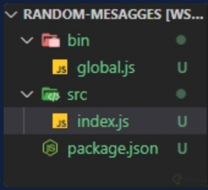

# Crear un paquete

Al crear un paquete para NPM, podrás compartir tu trabajo a varios desarrolladores e `instalar tu paquete` mediante `npm install <tuPaquete>`. Te mostraré un ejemplo, un proyecto de mensajes aleatorios que estará instalado globalmente y se ejecutará mediante la terminal.

## Cómo colocar un nombre a tu paquete

Al publicar un paquete, es necesario que el nombre sea único, es decir, no debe existir ningún otro paquete publicado con el mismo nombre en `NPM`.

Sin embargo, no agregues números, ya que `NPM` lo detecta como spam. Es válido agregar tu nombre de usuario para diferenciarlo,

Asegúrate de eso buscando en la página oficial de `NPM` el nombre del paquete, si no hay coincidencias lo puedes publicar.

## Proyecto de mensajes aleatorios

Como buena práctica, crea un repositorio remoto en GitHub(con el mismo nombre del paquete que quieres publicar) y clónalo en tu computador. Después, inicia un proyecto con `NPM` con el comando `npm init -y`. Con esto ya tienes todo listo para empezar el proyecto.

Dentro del proyecto crea la siguiente estructura de archivos:

* Un directorio llamado src que contenga el archivo principal del proyecto `index.js`
* Un directorio llamado bin que contenga un archivo ejecutable `global.js`



## Creando el archivo index.js

En el archivo `index.js` agrega el siguiente código:

* Un array llamado messages que contiene los mensajes
* Una función funnyCommit que mostrará de manera aleatoria los elementos del array, es decir, los mensajes aleatorios.
* Al final, exporta la función mediante `module.exports`.

```shell
const messages = [
  "This is where it all begins...",
  "Commit committed",
  "Version control is awful",
  "COMMIT ALL THE FILES!",
  "The same thing we do every night, Pinky - try to take over the world!",
  "Lock S-foils in attack position",
  "This commit is a lie",
  "I'll explain when you're older!",
  "Here be Dragons",
  "Reinventing the wheel. Again.",
  "This is not the commit message you are looking for",
  "Batman! (this commit has no parents)",
];

const funnyCommit = () => {
  const message = messages[Math.floor(Math.random() * messages.length)];
  console.log(`\x1b[34m${message}\x1b[89m`);
}

module.exports = {
  funnyCommit
};
```

## Creando el archivo `global.js`

En el archivo `global.js` agrega el siguiente código, en el que importamos la función del archivo `index.js` y la ejecutamos.

```shell
!/usr/bin/env node
let random = require('../src/index.js');

random.funnyCommit();
```

!/`usr/bin/env node` es una instrucción que sirve para indicar que este archivo se ejecutará con `Nodejs`. Después realizamos la importación de nuestro archivo index.js. Finalmente, ejecutamos la función de mensajes aleatorios funnyCommit.

## Modificar el archivo `package.json` para el proyecto

En el archivo `package.json`, agrega `"bin"` haciendo referencia a nuestro archivo `global.js` y `"preferGlobal"` en true.

``` bash
{
    ...
    "bin": {
        "random-str-msg": "./bin/global.js"
    },
    "preferGlobal": true
}
```

El nombre que especifiquemos dentro de `"bin"` será el que utilicemos en la terminal cuando el paquete esté instalado.

¡Listo! Ya tienes un paquete para publicarlo en `NPM`.
